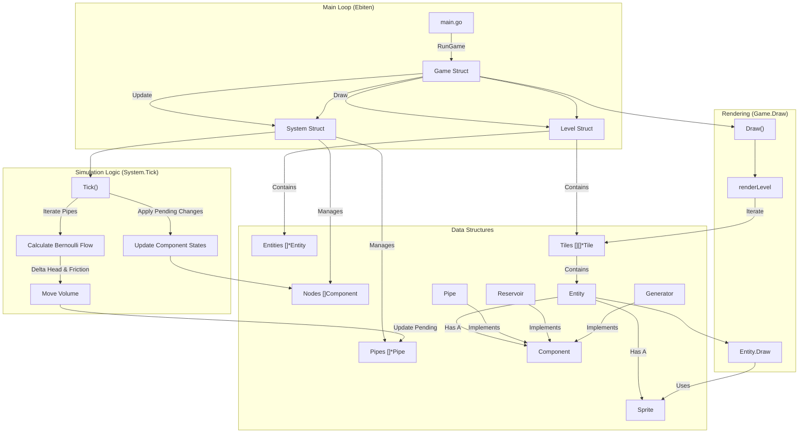

 

# Gengeno

A generator game written in Go using Ebitengine.

## Goal
Other than learning Go and Ebitengine, I want to create a game about generating power employing anything from coal, fuel, hydro, nucelar, and more.  The goal is to create semi-realistic simulation of power generation and distribution.

## Ideas Implemented (in no particular order)

- Pipes and Reservoirs
- Pressure based flow
- Sprites
- Sprites updated based on state
- Isometric view

## Ideas Not Implemented (in no particular order)

- Generators
- Power simulation
- Material properties
- Heat simulation
- UI
- Non-placeholder assets

## Program Flow

